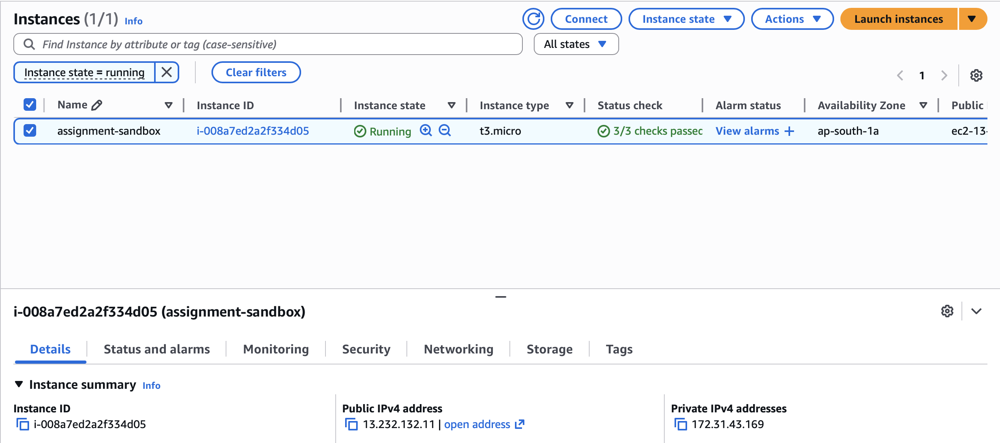
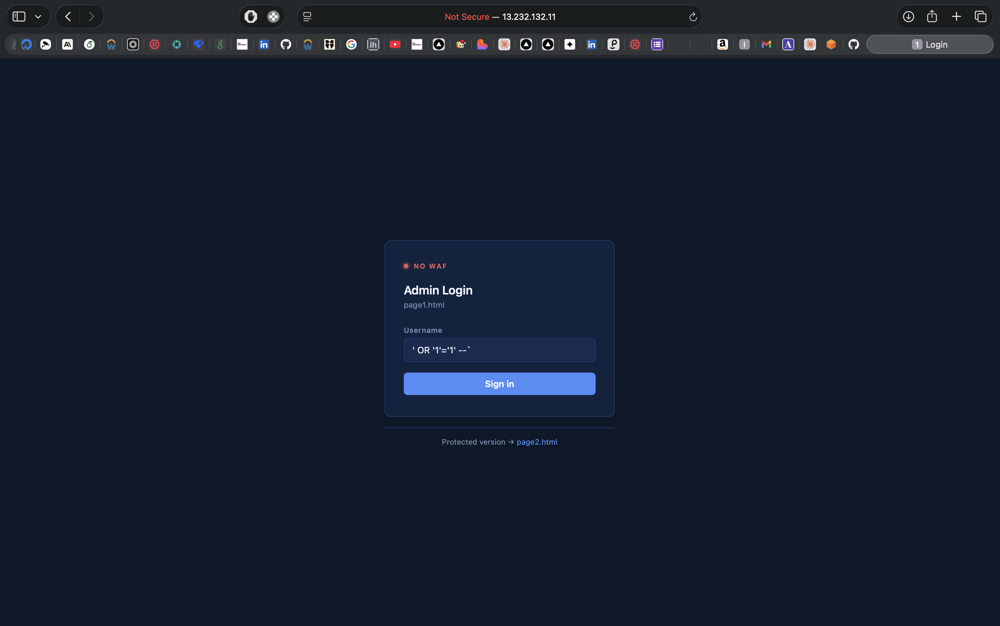
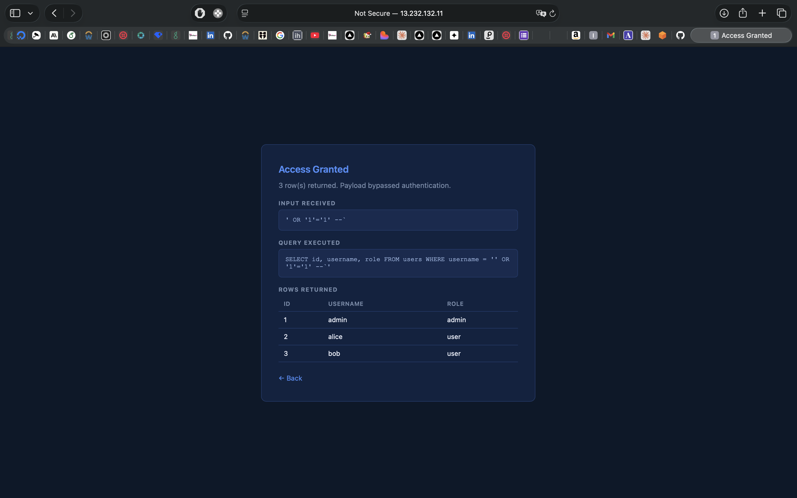
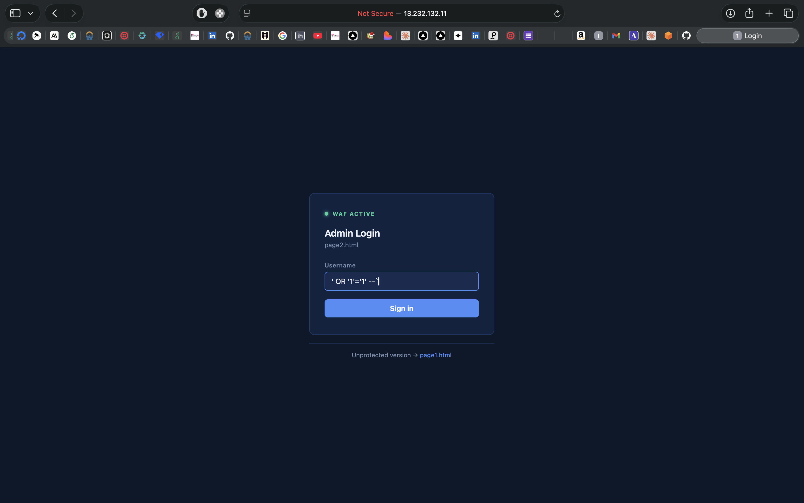
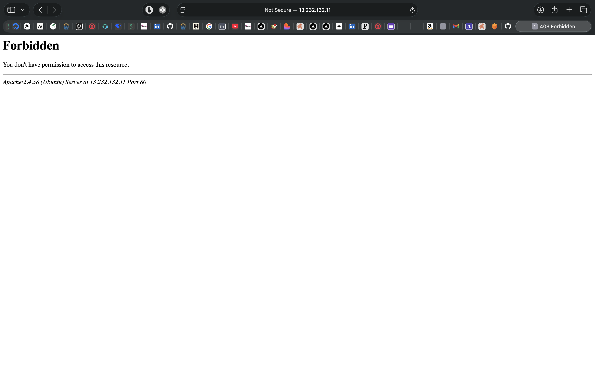
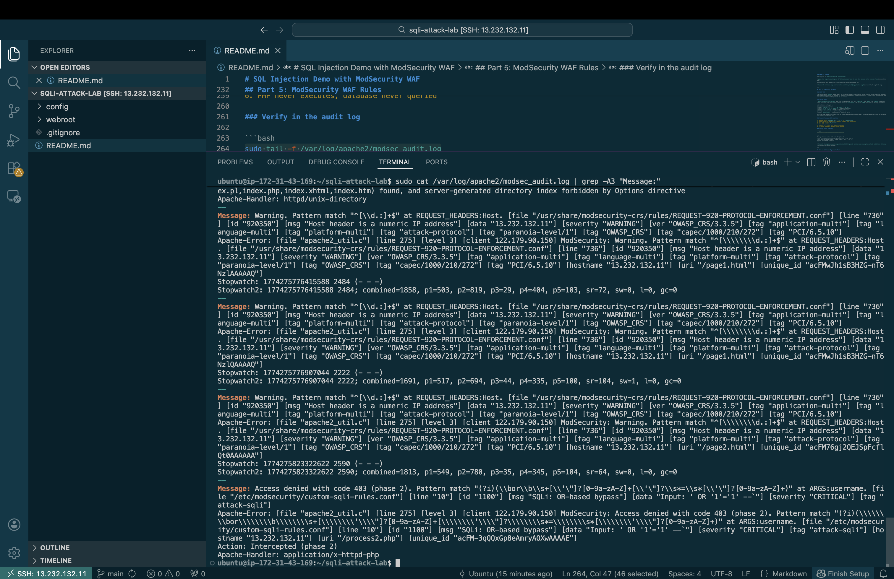

# SQL Injection Demo with ModSecurity WAF

Demonstrates a SQL injection vulnerability and its WAF-based mitigation on AWS EC2. Two login pages hit the same vulnerable PHP backend. ModSecurity is disabled for page1 and enforced for page2 at the Apache layer.

| | URL |
|---|---|
| Exploitable | `http://13.232.132.11/page1.html` |
| Protected | `http://13.232.132.11/page2.html` |

**Stack:** Ubuntu 24.04 LTS, Apache 2.4, PHP 8.3, SQLite3, ModSecurity v2, OWASP CRS v3.3

---

## Repository Structure

```
sqli-waf-demo/
├── webroot/
│   ├── page1.html              login form, no WAF
│   ├── page2.html              login form, WAF active
│   ├── process1.php            vulnerable backend, WAF bypassed
│   ├── process2.php            vulnerable backend, WAF enforced
│   └── setup_db.php            seeds the SQLite database
├── config/
│   ├── sqli-demo.conf          Apache VirtualHost
│   └── custom-sqli-rules.conf  ModSecurity SQLi rules
```

---

## Part 1: EC2 Setup

### Launch the instance

1. Go to AWS Console > EC2 > Launch Instance
2. Configure:
   - **Name:** `assignment-sandbox`
   - **AMI:** Ubuntu Server 24.04 LTS (HVM, SSD)
   - **Instance type:** `t3.micro`
   - **Key pair:** Create new, name it `assignment-sandbox`, download the `.pem`
3. Under Network settings, create a security group with these inbound rules:

   | Type | Port | Source |
   |------|------|--------|
   | SSH | 22 | My IP |
   | HTTP | 80 | 0.0.0.0/0 |

4. Launch and wait for both status checks to pass
5. Note the Public IPv4 address



### Connect

```bash
chmod 400 ~/Downloads/assignment-sandbox.pem
ssh -i ~/Downloads/assignment-sandbox.pem ubuntu@13.232.132.11
```

---

## Part 2: Server Configuration

### Install dependencies

```bash
sudo apt-get update && sudo apt-get upgrade -y
sudo apt-get install -y apache2 php libapache2-mod-php php-sqlite3 \
    libapache2-mod-security2 modsecurity-crs
sudo a2enmod security2
```

### Configure ModSecurity

```bash
sudo cp /etc/modsecurity/modsecurity.conf-recommended /etc/modsecurity/modsecurity.conf

sudo sed -i 's/SecRuleEngine DetectionOnly/SecRuleEngine On/'     /etc/modsecurity/modsecurity.conf
sudo sed -i 's/SecRequestBodyAccess Off/SecRequestBodyAccess On/' /etc/modsecurity/modsecurity.conf
sudo sed -i 's/SecAuditEngine Off/SecAuditEngine RelevantOnly/'   /etc/modsecurity/modsecurity.conf
```

Check that CRS is wired into Apache's security2 module:

```bash
cat /etc/apache2/mods-available/security2.conf
```

If there is no line referencing `modsecurity-crs`, add it:

```bash
echo "IncludeOptional /usr/share/modsecurity-crs/*.load" | \
    sudo tee -a /etc/apache2/mods-available/security2.conf
```

---

## Part 3: Deploy the Application

### Clone and copy files

```bash
cd ~
git clone https://github.com/utkarshrai2811/sqli-attack-lab.git
cd sqli-attack-lab

sudo rm -f /var/www/html/index.html
sudo cp webroot/* /var/www/html/

sudo mkdir -p /var/www/html/db
sudo chown www-data:www-data /var/www/html/db
sudo chmod 750 /var/www/html/db
sudo chown -R www-data:www-data /var/www/html
```

### Install custom WAF rules

```bash
sudo cp config/custom-sqli-rules.conf /etc/modsecurity/
```

The `/etc/modsecurity/` directory is glob-included by Apache's security2 module, so the file is picked up automatically. Do not add an explicit `Include` line for it in `modsecurity.conf` -- that causes a duplicate-load error on `configtest`.

Confirm no duplicate include exists:

```bash
grep "custom-sqli" /etc/modsecurity/modsecurity.conf
# should return nothing
```

If it returns something:

```bash
sudo sed -i '/custom-sqli-rules/d' /etc/modsecurity/modsecurity.conf
```

### Configure Apache VirtualHost

```bash
sudo cp config/sqli-demo.conf /etc/apache2/sites-available/
sudo a2dissite 000-default.conf
sudo a2ensite sqli-demo.conf
```

The VirtualHost config is the core of the demo. `SecRuleEngine Off` on process1 lets the injection through. `SecRuleEngine On` on process2 enforces the rules.

```apache
<VirtualHost *:80>
    DocumentRoot /var/www/html
    SecRuleEngine On

    <Directory /var/www/html>
        Options -Indexes
    </Directory>

    <Location /process1.php>
        SecRuleEngine Off
    </Location>

    <Location /process2.php>
        SecRuleEngine On
    </Location>

    <Directory /var/www/html/db>
        Require all denied
    </Directory>
</VirtualHost>
```

```bash
sudo apache2ctl configtest
# must say: Syntax OK

sudo systemctl restart apache2
```

### Seed the database

```bash
curl http://localhost/setup_db.php
# output: Done. Users created: admin, alice, bob

sudo chown www-data:www-data /var/www/html/db/users.db
sudo chmod 640 /var/www/html/db/users.db
```

---

## Part 4: The Vulnerability

The backend query on both pages is:

```php
$query = "SELECT id, username, role FROM users WHERE username = '$username'";
$result = $db->query($query);
```

User input is concatenated directly into the SQL string. The database cannot distinguish the intended SQL from attacker-injected SQL.

**Payload:** `' OR '1'='1' --`

The query becomes:

```sql
SELECT id, username, role FROM users WHERE username = '' OR '1'='1' --'
```

`OR '1'='1'` is always true. `--` comments out the rest. Every row in the table is returned, bypassing authentication.

### page1 -- exploitable

Navigate to `http://13.232.132.11/page1.html`, enter `' OR '1'='1' --`, submit.



The response shows the injected query and all rows returned from the database.



### page2 -- blocked

Same payload on `http://13.232.132.11/page2.html`.



Apache returns 403. ModSecurity intercepted the request before PHP ran.



---

## Part 5: ModSecurity WAF Rules

### OWASP CRS

The installed CRS `942xxx` group covers SQL injection broadly: tautologies, UNION attacks, blind injection, benchmark/sleep probes, and comment obfuscation. It operates in anomaly scoring mode -- requests accumulate a score across matched rules and are blocked when the inbound threshold (default: 5) is exceeded.

### Custom rules

`config/custom-sqli-rules.conf` adds five targeted rules with IDs `1100-1104`. The `900xxx` and `999xxx` ranges are reserved by CRS setup rules and will cause a duplicate-ID error on `configtest`. IDs below `10000` that are not already claimed are safe.

| ID | Pattern | Targets |
|----|---------|---------|
| 1100 | `\bor\b ... = ...` | `' OR '1'='1'`, `or 1=1` |
| 1101 | `--, #, /* */` | `admin'--`, comment injection |
| 1102 | `union.*select` | UNION-based data extraction |
| 1103 | `; drop/insert/...` | Stacked queries |
| 1104 | `@detectSQLi` | libModSecurity heuristic parser |

Rule 1104 uses ModSecurity's built-in SQL syntax engine rather than a regex. It catches encoding tricks and whitespace obfuscation that pattern-based rules miss.

### Request flow when WAF is active

1. Browser POSTs `username=' OR '1'='1' --` to `/process2.php`
2. Apache passes to ModSecurity (phase 2, request body inspection)
3. Rule 1100 matches `OR '1'='1'`
4. Rule 1101 matches `--`
5. ModSecurity returns 403, request is dropped
6. PHP never executes, database never queried

### Verify in the audit log

```bash
sudo tail -f /var/log/apache2/modsec_audit.log
```

```
Message: Access denied with code 403 (phase 2).
[file "/etc/modsecurity/custom-sqli-rules.conf"] [id "1100"]
[msg "SQLi: OR-based bypass"] [data "Input: ' OR '1'='1' --"]
Action: Intercepted (phase 2)
```



---

## Part 6: Additional Payloads to Test

All bypass authentication on page1 and are blocked on page2:

| Payload | Technique |
|---------|-----------|
| `' OR '1'='1' --` | OR tautology |
| `admin'--` | Comment truncation |
| `' OR 1=1--` | Numeric tautology |
| `' UNION SELECT 1,username,role FROM users--` | UNION extraction |
| `'; DROP TABLE users;--` | Stacked destructive query |

---

## Updating Files

HTML and PHP changes take effect immediately after copying, no restart needed:

```bash
sudo cp webroot/page1.html /var/www/html/page1.html
```

Apache config changes:

```bash
sudo systemctl reload apache2
```

ModSecurity rule changes require a full restart since rules are loaded at startup:

```bash
sudo cp config/custom-sqli-rules.conf /etc/modsecurity/
sudo systemctl restart apache2
```

---

## Troubleshooting

**configtest: "Found another rule with the same id"**
Custom rules file loaded twice. Remove the duplicate include:
```bash
sudo sed -i '/custom-sqli-rules/d' /etc/modsecurity/modsecurity.conf
sudo apache2ctl configtest
```

**page1 returning 403**
```bash
grep -A3 "process1" /etc/apache2/sites-available/sqli-demo.conf
sudo systemctl reload apache2
```

**PHP cannot write to the database**
```bash
sudo chown www-data:www-data /var/www/html/db /var/www/html/db/users.db
sudo chmod 750 /var/www/html/db && sudo chmod 640 /var/www/html/db/users.db
```

**Audit log empty after sending a payload**
```bash
grep "SecAuditLog " /etc/modsecurity/modsecurity.conf
sudo tail -f /var/log/apache2/modsec_audit.log
```

---

## Security Note

The correct fix at the code level is a parameterized query:

```php
$stmt = $db->prepare("SELECT id, username, role FROM users WHERE username = :u");
$stmt->bindValue(':u', $username, SQLITE3_TEXT);
$result = $stmt->execute();
```

The WAF provides defense-in-depth. It is not a substitute for safe queries.

---

## References

- [OWASP SQL Injection](https://owasp.org/www-community/attacks/SQL_Injection)
- [OWASP Core Rule Set](https://coreruleset.org/)
- [ModSecurity Reference Manual v2](https://github.com/owasp-modsecurity/ModSecurity/wiki/Reference-Manual-(v2.x))
- [CRS SQLi rules 942xxx](https://github.com/coreruleset/coreruleset/blob/main/rules/REQUEST-942-APPLICATION-ATTACK-SQLI.conf)